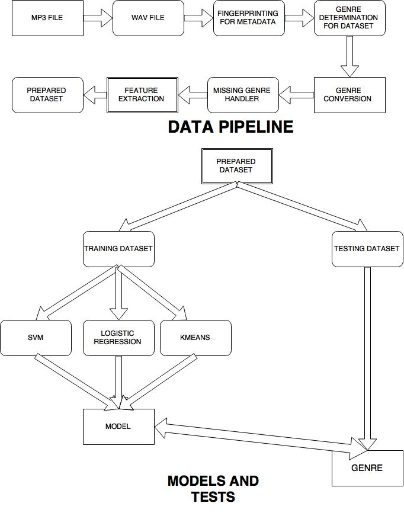

#MUSIC GENRE CLASSIFICATION 

#####Sriram Sundaraj,Ajay Prasadh 

#####National Institute Of Technology,Trichy

###Introduction
	The intelligent machine is an evil genie, escaped from its bottle.
										-	BRIAN HERBERT & KEVIN J. ANDERSON, The Butlerian Jihad

Automatic music genre classification is an application of artificial intelligence, more specifically machine learning, that builds a system that predicts the genre of a song.
It is fairly simple for a human being to identify the genre of a song. One thinks about how fast the beat of the song is, the mood the song, the video of the song, etc. All these help create a mental picture of the song and thus the genres associated with it are determined.
Automatic genre classification can be useful to answer some very intersting questions while making song recommendations, finding similiar songs, finding people who will like that particular song, etc.
Intelligene and automation are the core ideas that drove us to making this sytem.

###Related Work

* Several models have been made to solve this problem like Music Genre Classification with the Million Song Dataset [1], which uses audio features and lyrical features. The Model builds a bag of words for the lyrical features. For the audio features, they used the MFCC (Mel-frequency cepstral coefficients)[2]. Their work was unique in how they used lyrical features.

* Another paper along the same lines is Automatic Musical Genre Classification Of Audio Signals [3]. A vector of size 9 (mean-Centroid, mean-Rolloff, mean-Flux, mean-ZeroCrossings, std-Centroid, std-Rolloff, std-Flux, std-ZeroCrossings, LowEnegry) was used as their MusicalSurfaceFeatures vector. Rhythm features were determined and their model was built using both the vectors.

Our work differs from the previous two with respect to the feature vector under consideration. The song has been analyzed as a wave and as a song well.

##FLOW DIAGRAM

###FEATURE EXTRACTION
* We treated the song as a wave and as a song as well, meaning some features were based on wave properties, and other features were based on song level characteristics. The feature vector is of length 19. 13 features were the MFCC (Mel-frequency cepstral coefficients)[2].  [4]

######CALCULATION OF MFCC  (13 features)
* MFCC was calculated using the open source scikit audiolabs library.
* A highlevel description of MFCC Calulcation [5] is explained below: 
 Frame the signal into short frames.
 For each frame calculate the periodogram estimate of the power spectrum.
 Apply the mel filterbank to the power spectra, sum the energy in each filter.
 Take the logarithm of all filterbank energies.
 Take the DCT of the log filterbank energies.
 Keep DCT coefficients 2-13, discard the rest.
	

######CALCULATION OF SCALE (5 features)

* We used an approximation to calculate the scale of the song. We took the five most frequently occuring frequencies in the song in groups of 5.
* This led to the the length of the frequency vector being 5.
* This doesn't exactly represent the scale, but we felt that it would be a better representation than just the average pitch of the song.

######CALCULATION OF TEMPO (1 feature)

* We felt that tempo of the song would be a good indicator of the genre, hence we selected tempo as the other feature.
* We used @scaperot's BPM tool to find the BPM of the song.

###Dataset Description
* FingerPrinting the songs was done using the eyeD3 library[6]. Artist, album name and title of the song were obtained. Pygn [7], a wrapper over rhytm API was used to obtain the genre of the song. Using a local collection of 637 songs, we extracted features and with the genre obtained from Pygn [7] our dataset was prepared.

* The target genres were 'Urban', 'Classical', 'Electronica', 'Jazz', 'Pop', 'Soundtrack', 'Alternative & Punk', 'Rock', 'Other'.
	

	

######DATA CLEANING:
* Soundtrack, Other, Jazz, Classical and traditional were ignored due to low number of samples.

* Genre converted from string to integers through a map to suit models construction and prediction.

* Samples with missing genres were ignored.

###MODELS          

For building the models, we used the SCIKIT [8] library.The models we used are the standard classification algorithms Logistic Regression, Support Vector Machine and KMeans.

###RESULTS
* Results
* Figure-3 Accuracy across genres  classify test set genre wise and find % results
* Best Model svm or lr i guess 
* Conclusion

#####References:
* 1.Music Genre Classification with the Million Song Dataset. Dawen Liang,Haijie Gu, and Brendan O’Connor.

* 2.M. Muller. Information retrieval for music and motion. In Springer, 2007.

* 3.[ George Tzanetakis,Georg Essl,Perry Cook.Automatic Music Genre Classification for audio signals ](http://ismir2001.ismir.net/pdf/tzanetakis.pdf)

* 4.[ Scikits Audiolab ](https://pypi.python.org/pypi/scikits.audiolab/)

* 5.[ MFCC Calculation Theory ](http://www.practicalcryptography.com/miscellaneous/machine-learning/guide-mel-frequency-cepstral-coefficients-mfccs/)

* 6.[ eyeD3 ](https://pypi.python.org/pypi/eyeD3)

* 7.[ pygn ](https://github.com/cweichen/pygn)

* 8.[ scikit ](http://scikit-learn.org/stable/)
